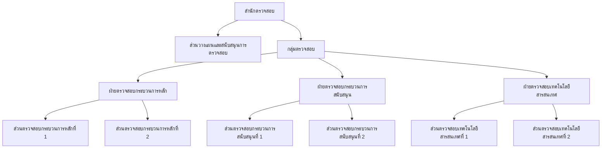

nt logo

# NT Org Chart โครงสร้าง @2024

## สำนักตรวจสอบ

**วันที่ 27 ธันวาคม 2567**
---

N-1  N-3
N-2  N-4

หน้า 2
---
สำนักตรวจสอบ

@2024

สำนักตรวจสอบ

กลุ่มตรวจสอบ

- ฝ่ายตรวจสอบกระบวนการหลัก
- ฝ่ายตรวจสอบกระบวนการสนับสนุน
- ฝ่ายตรวจสอบเทคโนโลยีสารสนเทศ

สำนักตรวจสอบ

1. กำหนดนโยบาย กรอบ และแนวทางการดำเนินงานด้านการตรวจสอบ การจัดทำกฎบัตร คู่มือการปฏิบัติงาน จรรยาบรรณของคณะกรรมการตรวจสอบและหน่วยงานตรวจสอบ ให้สอดคล้องกับทิศทางธุรกิจ และยุทธศาสตร์ขององค์กร

2. จัดทำแผนงานตรวจสอบในภาพรวมของสายงาน

3. วางแผนและพัฒนาการตรวจสอบ

4. ดำเนินงานตรวจสอบให้สอดคล้องกับนโยบาย เป้าหมาย กลยุทธ์ และแผนยุทธศาสตร์ เพื่อให้บรรลุวัตถุประสงค์ขององค์กร และสอดคล้องกับมาตรฐานวิชาชีพการตรวจสอบภายใน

5. สอบทานการบริหารงานและการดำเนินงานขององค์กรให้มีการปฏิบัติตามนโยบายขององค์กร และกฎหมายที่เกี่ยวข้อง และรวมถึง กฎ ระเบียบ ข้อบังคับ คำสั่ง มติคณะรัฐมนตรี นโยบายและสัญญาที่เกี่ยวข้อง

6. สอบทานและประเมินความความเสี่ยง ความเพียงพอของระบบการควบคุมภายใน การบริหารความเสี่ยง และการกำกับดูแล พร้อมทั้งสนับสนุนให้มีการควบคุมการปฏิบัติงานให้มีประสิทธิภาพ

7. รายงานผลการตรวจสอบ การควบคุมภายใน และรายงานผลการติดตามการปรับปรุงแก้ไขของส่วนงานต่าง ๆ ต่อฝ่ายบริหาร และคณะกรรมการตรวจสอบ

8. ประสานงานกับสำนักงานการตรวจเงินแผ่นดินและหรือผู้ตรวจสอบภายนอก เกี่ยวกับแผนการตรวจสอบและประเด็นที่เกี่ยวข้องในการปฏิบัติงาน

9. รับผิดชอบเกี่ยวกับงานเลขานุการคณะกรรมการตรวจสอบ

10. ดำเนินงานตามกรอบแนวทางการประเมินผลการดำเนินงาน รัฐวิสาหกิจ ตามระบบ State Enterprise Assessment Model (SE-AM) ด้านการตรวจสอบภายใน

11. สอบทานและให้คำปรึกษาแนะนำการดำเนินงานตามกรอบแนวทางการประเมินผลการดำเนินงานรัฐวิสาหกิจ ตามระบบ State Enterprise Assessment Model (SE-AM) ทุก ๆ ด้าน

12. จัดทำแผนดำเนินงานอย่างต่อเนื่อง (Business Continuity Plan – BCP) และบริหารความต่อเนื่องทางการดำเนินงาน (Business Continuity Management – BCM)

13. ปฏิบัติงานอื่นที่เกี่ยวข้องหรือที่ได้รับมอบหมาย
---
สำนักตรวจสอบ

@2024

สำนักตรวจสอบ

- ส่วนวางแผนและสนับสนุนการตรวจสอบ

กลุ่มตรวจสอบ
- ฝ่ายตรวจสอบกระบวนการหลัก
- ฝ่ายตรวจสอบกระบวนการสนับสนุน
- ฝ่ายตรวจสอบเทคโนโลยีสารสนเทศ

ส่วนวางแผนและสนับสนุนการตรวจสอบ

1. จัดทำแผนการตรวจสอบเชิงกลยุทธ์และแผนการตรวจสอบประจำปี โดยพิจารณาตามความเสี่ยงในกิจกรรมต่าง ๆ ที่ทำให้วัตถุประสงค์ขององค์กรหรือกิจกรรมที่ดำเนินการไม่บรรลุผลตามที่กำหนด

2. กำหนดหลักเกณฑ์/ วิธีปฏิบัติ และจัดทำคู่มือการปฏิบัติงานตรวจสอบ รวมถึงจัดทำกฎบัตรของหน่วยตรวจสอบภายในตามมาตรฐานสากลวิชาชีพ รวมถึงเผยแพร่และประชาสัมพันธ์ข้อมูลกฎบัตร หลักเกณฑ์/วิธีปฏิบัติ ให้กับส่วนงานที่เกี่ยวข้อง

3. กำหนดหลักเกณฑ์การประเมินผลการปฏิบัติงานของสำนักตรวจสอบจากผู้ประเมินภายใน/ ผู้ประเมินภายนอกที่อิสระ และการประเมินตนเอง ให้เป็นไปตามแนวทางเดียวกับองค์กรและมาตรฐานวิชาชีพ รวมถึงการประเมินคุณภาพงานตรวจสอบภายใน

4. ประสานงานผู้บริหาร พนักงานภายในองค์กร สำนักงานการตรวจเงินแผ่นดิน และหรือผู้ตรวจสอบภายนอก ให้บรรลุตามวัตถุประสงค์งานตรวจสอบภายใน รวมถึงการมีส่วนร่วมในการดำเนินงานแผนงาน/ โครงการต่าง ๆ ที่สำคัญขององค์กร ตามมาตรฐานวิชาชีพ

5. ศึกษา ติดตามมาตรฐานการตรวจสอบ รวมทั้งนำเทคนิคการตรวจสอบและเทคโนโลยีสารสนเทศที่ทันสมัยมาช่วยในการตรวจสอบ พัฒนาวิธีการตรวจสอบเพื่อเป็นเครื่องมือช่วยในการตรวจสอบ โดยออกแบบ ทดสอบ พัฒนาปรับปรุงโปรแกรมสนับสนุนกระบวนการตรวจสอบภายในให้เป็นกระบวนการแบบอัตโนมัติ

6. จัดทำแผนบริหารและพัฒนาบุคลากรเชิงกลยุทธ์และแผนประจำปีของสำนักตรวจสอบ ให้สอดคล้องกับแผนการตรวจสอบ ประสานงานอำนวยความสะดวกการจัดอบรม และการจัดทำรายงานสรุปผลการบริหารและพัฒนาบุคลากรของสำนักตรวจสอบ

7. รวบรวมรายงานผลการตรวจสอบ และผลการดำเนินการปรับปรุงแก้ไขของส่วนงานต่าง ๆ ตามรายงานผลการตรวจสอบ และจัดทำรายงานสรุปผลการตรวจสอบและการให้คำปรึกษา รวมทั้งดูแลการจัดการความรู้ของสำนักตรวจสอบ

8. ติดตามและประเมินผลการปฏิบัติงานตรวจสอบ ตลอดจนจัดทำแผนปฏิบัติการเกี่ยวกับการพัฒนา และปรับปรุงงานตรวจสอบ ให้บรรลุเป้าหมายตามที่กำหนด

9. รับผิดชอบงานเลขานุการคณะกรรมการตรวจสอบ สนับสนุน และช่วยเหลือการปฏิบัติหน้าที่ของคณะกรรมการตรวจสอบ ให้เป็นไปตามกฎหมาย ระเบียบและข้อบังคับที่กำหนด ตลอดจนจัดทำสรุปรายงานผลการปฏิบัติงาน ของคณะกรรมการตรวจสอบเสนอคณะกรรมการบริษัท รวมถึงประสานงานและอำนวยความสะดวกในการประชุมคณะกรรมการตรวจสอบ

10. ประสานงานกับสำนักงานการตรวจเงินแผ่นดินและหรือผู้ตรวจสอบภายนอก เกี่ยวกับแผนการตรวจสอบและประเด็นที่เกี่ยวข้องในการปฏิบัติงาน

11. ดำเนินงานตามกรอบแนวทางการประเมินผลการดำเนินงานรัฐวิสาหกิจ ตามระบบ State Enterprise Assessment Model (SE-AM) ด้านการตรวจสอบภายใน
---
สำนักตรวจสอบ

@2024

สำนักตรวจสอบ

- ส่วนวางแผนและสนับสนุนการตรวจสอบ

กลุ่มตรวจสอบ

- ฝ่ายตรวจสอบกระบวนการหลัก
- ฝ่ายตรวจสอบกระบวนการสนับสนุน
- ฝ่ายตรวจสอบเทคโนโลยีสารสนเทศ

ส่วนวางแผนและสนับสนุนการตรวจสอบ (ต่อ)

12. จัดทำแผนปฏิบัติการที่เกี่ยวกับงานสนับสนุนและบริการสายงาน
13. รับผิดชอบงานด้านบุคคลและสวัสดิการให้แก่พนักงานในสำนักที่รับผิดชอบ
    13.1 ดำเนินการเกี่ยวกับงานบุคคล ได้แก่ งานการลา การลงเวลาทำงาน งานบันทึกประวัติส่วนบุคคล ตลอดจนงานอื่น ๆ ที่เกี่ยวข้องกับบุคคลตามหลักเกณฑ์ขององค์กร
    13.2 ตรวจสอบเงินสวัสดิการ และค่าตอบแทนแรงงานพนักงาน
    13.3 รับผิดชอบในการเบิกจ่ายเงินค่าตอบแทนต่าง ๆ เช่น ค่าทำงานในวันหยุด ค่าทำงานนอกเวลาปกติ ค่าล่วงเวลาในวันหยุด เงินเพิ่มพิเศษเป็นกะ เงินบำรุงสุขภาพ ฯลฯ
    13.4 รับผิดชอบการอนุมัติและตั้งหนี้เบิกค่าใช้จ่ายที่อยู่ในความรับผิดชอบ ตรวจสอบสิทธิ อนุมัติและตั้งหนี้ค่าใช้จ่ายด้านสวัสดิการต่าง ๆ ตามที่องค์กรมอบหมาย เช่น ตรวจสอบสิทธิการจ่ายเงินให้กับโรงพยาบาลที่มีข้อตกลงร่วมกับองค์กร อนุมัติและตั้งหนี้จ่ายค่ารักษาพยาบาลในระบบสารสนเทศ เบิกจ่ายสวัสดิการให้แก่พนักงานทั้งในและนอกระบบ SAP เป็นต้น
14. ดำเนินการเกี่ยวกับงานอำนวยการของสำนัก เช่น บริหารงานการประชุม การจองห้องประชุม เป็นต้น
15. ดำเนินการเกี่ยวกับงานด้านเลขานุการของผู้บริหารระดับผู้จัดการฝ่ายขึ้นไป เช่น วิเคราะห์ กลั่นกรองเอกสารที่นำเสนอต่อผู้บริหารเพื่อประกอบการพิจารณาและสั่งการ ลงทะเบียนรับ-ส่งหนังสือ แจกจ่าย จัดเก็บ ถ่ายสำเนา จัดแฟ้มเสนอผู้บริหาร รวมถึงการร่างหนังสือ ส่งหนังสือ พิมพ์เอกสาร รวมทั้งประสานงาน ติดตาม และประเมินผลในงานที่ส่วนต่าง ๆ ได้รับมอบหมาย เป็นต้น
16. ดำเนินงานด้านงานสารบรรณ การร่างหนังสือ ส่งหนังสือ พิมพ์เอกสาร การจัดทำรายงานของสายงาน
17. รับผิดชอบการรวบรวมคำขอตั้งงบประมาณประจำปี ของฝ่ายต่าง ๆ เสนอต่อผู้ที่เกี่ยวข้อง
18. ดำเนินการเกี่ยวกับงานงบประมาณ งานบัญชี รับ-จ่ายเงิน และงานภาษี ตามนโยบาย หลักเกณฑ์ และข้อกำหนดของสายงานการเงิน รวมถึงรายงานติดตามงบประมาณประจำปี งบทำการ ให้กับส่วนงานที่รับผิดชอบ
19. รับผิดชอบเบิกจ่ายเงินค่าใช้จ่ายต่าง ๆ เช่น ค่าเช่าสถานที่ ค่าแท็กซี่ ค่าผ่านทางพิเศษ ค่าใช้จ่ายในการประชุม ค่ารับรองทั่วไป เป็นต้น
20. รับผิดชอบยืมเงินทดรอง/หักล้างเงินยืมทดรอง เบิกจ่ายด้านการเงินต่าง ๆ รวมทั้ง ประสานงานกับส่วนงานที่เกี่ยวข้องในงานทั่วไปของ แต่ละส่วนงานที่รับผิดชอบ
---
# สำนักตรวจสอบ

@2024

## สำนักตรวจสอบ

- ส่วนวางแผนและสนับสนุนการตรวจสอบ

### กลุ่มตรวจสอบ

- ฝ่ายตรวจสอบกระบวนการหลัก
- ฝ่ายตรวจสอบกระบวนการสนับสนุน
- ฝ่ายตรวจสอบเทคโนโลยีสารสนเทศ

## ส่วนวางแผนและสนับสนุนการตรวจสอบ (ต่อ)

21. ดำเนินการจัดซื้อ จัดจ้าง และบริหารพัสดุตามที่องค์กรกำหนด
22. ดำเนินงานที่เกี่ยวกับต่างประเทศ เช่น งานจองบัตรโดยสารเครื่องบิน จองโรงแรม ทำหนังสือเดินทาง หนังสือตรวจลงตรา รวมถึง สรุปข้อมูลการเดินทางไปต่างประเทศของพนักงาน และค่าใช้จ่าย/งบประมาณในภาพรวม รวมถึงดูแลฐานข้อมูลภาพรวมการเดินทางไปต่างประเทศของพนักงาน
23. ติดตาม รวบรวม และรายงานผลการดำเนินงานที่รับผิดชอบ
24. จัดทำ ทบทวน และปรับปรุง กระบวนการทำงานของส่วนงานให้เป็นไปตามแนวทางการจัดทำคู่มือปฏิบัติงานตามที่องค์กรกำหนด โดยมุ่งเน้นการนำเทคโนโลยีดิจิทัลมาปรับใช้ เพื่อเพิ่มประสิทธิภาพการปฏิบัติงาน
25. ปฏิบัติงานอื่นที่เกี่ยวข้องหรือที่ได้รับมอบหมาย
---
สำนักตรวจสอบ

@2024

สำนักตรวจสอบ

► กลุ่มตรวจสอบ

- ฝ่ายตรวจสอบกระบวนการหลัก
- ฝ่ายตรวจสอบกระบวนการสนับสนุน
- ฝ่ายตรวจสอบเทคโนโลยีสารสนเทศ

กลุ่มตรวจสอบ

1. รับนโยบายจากรองกรรมการผู้จัดการสำนักตรวจสอบ
2. กำหนดกรอบ และแนวทางการดำเนินงานด้านการตรวจสอบ การจัดทำกฎบัตร คู่มือการปฏิบัติงาน จรรยาบรรณของคณะกรรมการตรวจสอบ และหน่วยงานตรวจสอบให้สอดคล้องกับทิศทางธุรกิจ และยุทธศาสตร์องค์กร
3. ดำเนินงานตรวจสอบให้สอดคล้องกับนโยบาย เป้าหมาย กลยุทธ์ และแผนยุทธศาสตร์ เพื่อให้บรรลุวัตถุประสงค์ขององค์กร และสอดคล้องกับมาตรฐานวิชาชีพการตรวจสอบภายใน
4. ให้ข้อเสนอแนะในการพัฒนาปรับปรุงกระบวนการทำงาน ให้เป็นกระบวนการอัตโนมัติ (Automated Process) โดยใช้เครื่องมือทางเทคนิค ให้เห็นภาพการเชื่อมต่อกระบวนการย่อยหลายๆ กระบวนการ ให้เป็นกระบวนการใหญ่ และให้เห็นการเชื่อมต่อของฐานข้อมูลต่าง ๆ เข้ากับกระบวนการใหญ่ ตลอดจนกำหนดเงื่อนไขต่าง ๆ ในการไหลของงาน เพื่อผลักดันให้เป็น Digital Workflow
5. สืบหาข้อเท็จจริง และวิเคราะห์ข้อมูล เชื่อมโยงข้อมูลที่มีความซับซ้อน นำเสนอข้อสังเกตและข้อเสนอแนะในการแก้ไขปัญหาที่มีรูปแบบคล้ายคลึงหรือปัญหาที่เชื่อมโยงกันระหว่างส่วนงานต่าง ๆ เพื่อปรับปรุงกระบวนการทำงานที่มีความสอดคล้องกันได้
6. สอบทานการบริหารงานและการดำเนินงานขององค์กรให้มีการปฏิบัติตามนโยบายขององค์กร และกฎหมายที่เกี่ยวข้อง และรวมถึง กฎ ระเบียบ ข้อบังคับ คำสั่ง มติคณะรัฐมนตรี นโยบายและสัญญาที่เกี่ยวข้อง
7. สอบทานและประเมินความความเสี่ยง ความเพียงพอของระบบการควบคุมภายใน การบริหารความเสี่ยง และการกำกับดูแล พร้อมทั้งสนับสนุนให้มีการควบคุมการปฏิบัติงานให้มีประสิทธิภาพ
8. สอบทานและประเมินความเสี่ยงเกี่ยวกับมาตรการป้องกันการทุจริตขององค์กร
9. รายงานผลการตรวจสอบ การควบคุมภายใน และรายงานผลการติดตามการปรับปรุงแก้ไขของส่วนงานต่าง ๆ ต่อฝ่ายบริหาร และคณะกรรมการตรวจสอบ
10. ประสานงานกับสำนักงานการตรวจเงินแผ่นดินและหรือผู้ตรวจสอบภายนอก เกี่ยวกับแผนการตรวจสอบและประเด็นที่เกี่ยวข้องในการปฏิบัติงาน
11. รวบรวม ติดตามและรายงานผลการสอบทานการดำเนินงานตามกรอบแนวทางการประเมินผลการดำเนินงานรัฐวิสาหกิจ ตามระบบ State Enterprise Assessment Model (SE-AM) ทุก ๆ ด้าน
12. สอบทานและให้คำปรึกษาแนะนำการจัดทำแผนดำเนินงานอย่างต่อเนื่อง (Business Continuity Plan – BCP) และบริหารความต่อเนื่องทางการดำเนินงาน (Business Continuity Management – BCM)
13. ปฏิบัติงานอื่นที่เกี่ยวข้องหรือที่ได้รับมอบหมาย
---
สำนักตรวจสอบ

@2024

สำนักตรวจสอบ

กลุ่มตรวจสอบ

- ฝ่ายตรวจสอบกระบวนการหลัก
- ฝ่ายตรวจสอบกระบวนการสนับสนุน
- ฝ่ายตรวจสอบเทคโนโลยีสารสนเทศ

## ฝ่ายตรวจสอบกระบวนการหลัก

1. วางแผน กำหนดเป้าหมายการดำเนินงานเกี่ยวกับการตรวจสอบกระบวนการหลัก ตลอดจนสนับสนุนให้ส่วนงานต่าง ๆ มีการควบคุมภายในที่มีประสิทธิผล จัดทำแผนตรวจสอบระยะสั้น (แผนตรวจสอบประจำปี) และแผนตรวจสอบระยะยาว

2. ดำเนินงานตรวจสอบกระบวนการหลักให้สอดคล้องกับนโยบาย เป้าหมาย กลยุทธ์ และแผนยุทธศาสตร์ เพื่อให้บรรลุวัตถุประสงค์ขององค์กร และสอดคล้องกับมาตรฐานวิชาชีพการตรวจสอบภายใน รวมทั้งนำเทคนิคการตรวจสอบและเทคโนโลยีสารสนเทศที่ทันสมัยมาช่วยในการตรวจสอบ

3. ให้ข้อเสนอแนะในการพัฒนาปรับปรุงกระบวนการทำงาน ให้เป็นกระบวนการอัตโนมัติ (Automated Process) โดยใช้เครื่องมือทางเทคนิค ให้เห็นภาพการเชื่อมต่อกระบวนการย่อยหลาย ๆ กระบวนการ ให้เป็นกระบวนการใหญ่ และให้เห็นการเชื่อมต่อของฐานข้อมูลต่าง ๆ เข้ากับกระบวนการใหญ่ ตลอดจนกำหนดเงื่อนไขต่าง ๆ ในการไหลของงาน เพื่อผลักดันให้เป็น Digital Workflow

4. สืบหาข้อเท็จจริง วิเคราะห์ข้อมูล และเชื่อมโยงข้อมูลที่มีความซับซ้อน นำเสนอข้อสังเกตและข้อเสนอแนะในการแก้ไขปัญหาที่มีรูปแบบคล้ายคลึงหรือปัญหาที่เชื่อมโยงกันระหว่างส่วนงานต่าง ๆ เพื่อปรับปรุงกระบวนการทำงานที่มีความสอดคล้องกันได้

5. ตรวจสอบการปฏิบัติตามกฎ ระเบียบ ข้อบังคับคำสั่งมติคณะรัฐมนตรีนโยบายและสัญญาที่เกี่ยวข้อง โดยมีการเสนอแนะวิธีหรือมาตรการในการปรับปรุงแก้ไขหรือให้คำแนะนำแก่ผู้บริหารทุกระดับ เพื่อให้การดำเนินงานเป็นไปอย่างถูกต้องตามหลักการกำกับดูแลกิจการที่ดี

6. สอบทาน ให้คำปรึกษา และสร้างความเชื่อมั่น โดยการประเมินประสิทธิภาพ และประสิทธิผลของ ระบบการควบคุมภายใน ระบบบริหารความเสี่ยง การกำกับดูแล และการดำเนินการด้านต่าง ๆ ตามกรอบแนวทางการประเมินผลการดำเนินงานรัฐวิสาหกิจ ตามระบบ State Enterprise Assessment Model (SE-AM) ทุก ๆ ด้าน

7. รายงานผลการตรวจสอบ และการให้คำปรึกษา ตลอดจนติดตามผลการดำเนินการปรับปรุงแก้ไขของส่วนงานต่าง ๆ ต่อฝ่ายบริหาร คณะกรรมการตรวจสอบ และหน่วยงานภายนอกที่เกี่ยวข้อง

8. สอบทานและให้คำปรึกษาแนะนำการจัดทำแผนดำเนินงานอย่างต่อเนื่อง (Business Continuity Plan – BCP) และบริหารความต่อเนื่องทางการดำเนินงาน (Business Continuity Management – BCM)

9. ปฏิบัติงานอื่นที่เกี่ยวข้องหรือที่ได้รับมอบหมาย
---
สำนักตรวจสอบ

@2024

สำนักตรวจสอบ

กลุ่มตรวจสอบ

- ฝ่ายตรวจสอบกระบวนการหลัก
  - ส่วนตรวจสอบกระบวนการหลักที่ 1
  - ส่วนตรวจสอบกระบวนการหลักที่ 2
- ฝ่ายตรวจสอบกระบวนการสนับสนุน
- ฝ่ายตรวจสอบเทคโนโลยีสารสนเทศ

## ส่วนตรวจสอบกระบวนการหลักที่ 1

1. จัดทำแผนปฏิบัติการในรายละเอียดของการตรวจสอบ ตามแผนการตรวจสอบที่ได้รับการอนุมัติทั้งแผนตรวจสอบระยะสั้น (แผนตรวจสอบประจำปี) และแผนตรวจสอบระยะยาว ตามฐานความเสี่ยงโดยให้มีความสอดคล้องกับยุทธศาสตร์ขององค์กร

2. ศึกษา ติดตามมาตรฐานการตรวจสอบ รวมทั้ง นำเทคนิคการตรวจสอบและเทคโนโลยีสารสนเทศที่ทันสมัยมาช่วยในการตรวจสอบ

3. ตรวจสอบและประเมินความเพียงพอ เกี่ยวกับมาตรการการบริหารความเสี่ยง การควบคุมภายในและการกำกับดูแลที่ฝ่ายบริหารกำหนดของกระบวนการหลัก ให้เป็นไปตามมาตรฐานการปฏิบัติงานวิชาชีพการตรวจสอบ

4. ให้ข้อเสนอแนะในการพัฒนาปรับปรุงกระบวนการทำงาน ให้เป็นกระบวนการอัตโนมัติ (Automated Process) โดยใช้เครื่องมือทางเทคนิค ให้เห็นภาพการเชื่อมต่อกระบวนการย่อยหลายๆ กระบวนการ ให้เป็นกระบวนการใหญ่ และให้เห็นการเชื่อมต่อของฐานข้อมูลต่าง ๆ เข้ากับกระบวนการใหญ่ ตลอดจนกำหนดเงื่อนไขต่าง ๆ ในการไหลของงาน เพื่อผลักดันให้เป็น Digital Workflow

5. สืบหาข้อเท็จจริง และวิเคราะห์ข้อมูล เชื่อมโยงข้อมูลที่มีความซับซ้อน นำเสนอข้อสังเกตและข้อเสนอแนะในการแก้ไขปัญหาที่มีรูปแบบคล้ายคลึงหรือปัญหาที่เชื่อมโยงกันระหว่างส่วนงานต่าง ๆ เพื่อปรับปรุงกระบวนการทำงานที่มีความสอดคล้องกันได้

6. จัดทำรายงานผลการตรวจสอบ แลกเปลี่ยนความเห็นกับผู้บริหารส่วนงานรับตรวจ พร้อมให้ข้อเสนอแนะในการแก้ไขปัญหาและอุปสรรค เพื่อเป็นแนวทางการบริหารงานให้มีประสิทธิภาพ ประสิทธิผล

7. ติดตามผลการดำเนินการปรับปรุงแก้ไขของส่วนงานต่าง ๆ เพื่อให้มั่นใจว่าผู้รับผิดชอบได้ดำเนินการปรับปรุงข้อบกพร่องที่ตรวจพบแล้ว และรายงานฝ่ายบริหาร และคณะกรรมการตรวจสอบ

8. สรุปรายงานผลการตรวจสอบนำเสนอ คณะกรรมการตรวจสอบ คณะกรรมการบริษัท และหน่วยงานภายนอกที่เกี่ยวข้อง

9. ให้คำแนะนำปรึกษาเกี่ยวกับการบริหารความเสี่ยง การควบคุมภายในและการกำกับดูแล รวมถึงแนวปฏิบัติที่ดี

10. สอบทานและให้คำปรึกษาแนะนำการดำเนินงานตามกรอบแนวทางการประเมินผลการดำเนินงานรัฐวิสาหกิจ ตามระบบ State Enterprise Assessment Model (SE-AM) ทุก ๆ ด้าน

11. จัดทำ ทบทวน และปรับปรุง กระบวนการทำงานของส่วนงานให้เป็นไปตามแนวทางการจัดทำคู่มือปฏิบัติงานตามที่องค์กรกำหนด โดยมุ่งเน้นการนำเทคโนโลยีดิจิทัลมาปรับใช้ เพื่อเพิ่มประสิทธิภาพการปฏิบัติงาน

12. ปฏิบัติงานอื่นที่เกี่ยวข้องหรือที่ได้รับมอบหมาย
---
สำนักตรวจสอบ
@2024

สำนักตรวจสอบ

กลุ่มตรวจสอบ

- ฝ่ายตรวจสอบกระบวนการหลัก
  - ส่วนตรวจสอบกระบวนการหลักที่ 1
  - ส่วนตรวจสอบกระบวนการหลักที่ 2
- ฝ่ายตรวจสอบกระบวนการสนับสนุน
- ฝ่ายตรวจสอบเทคโนโลยีสารสนเทศ

## ส่วนตรวจสอบกระบวนการหลักที่ 2

1. จัดทำแผนปฏิบัติการในรายละเอียดของการตรวจสอบ ตามแผนการตรวจสอบที่ได้รับการอนุมัติทั้งแผนตรวจสอบระยะสั้น (แผนตรวจสอบประจำปี) และแผนตรวจสอบระยะยาว ตามฐานความเสี่ยงโดยให้มีความสอดคล้องกับยุทธศาสตร์ขององค์กร

2. ศึกษา ติดตามมาตรฐานการตรวจสอบ รวมทั้ง นำเทคนิคการตรวจสอบและเทคโนโลยีสารสนเทศที่ทันสมัยมาช่วยในการตรวจสอบ

3. ตรวจสอบและประเมินความเพียงพอ เกี่ยวกับมาตรการการบริหารความเสี่ยง การควบคุมภายในและการกำกับดูแลที่ฝ่ายบริหารกำหนดของกระบวนการหลัก ให้เป็นไปตามมาตรฐานการปฏิบัติงานวิชาชีพการตรวจสอบ

4. ให้ข้อเสนอแนะในการพัฒนาปรับปรุงกระบวนการทำงาน ให้เป็นกระบวนการอัตโนมัติ (Automated Process) โดยใช้เครื่องมือทางเทคนิค ให้เห็นภาพการเชื่อมต่อกระบวนการย่อยหลายๆ กระบวนการ ให้เป็นกระบวนการใหญ่ และให้เห็นการเชื่อมต่อของฐานข้อมูลต่าง ๆ เข้ากับกระบวนการใหญ่ ตลอดจนกำหนดเงื่อนไขต่าง ๆ ในการไหลของงาน เพื่อผลักดันให้เป็น Digital Workflow

5. สืบหาข้อเท็จจริง และวิเคราะห์ข้อมูล เชื่อมโยงข้อมูลที่มีความซับซ้อน นำเสนอข้อสังเกตและข้อเสนอแนะในการแก้ไขปัญหาที่มีรูปแบบคล้ายคลึง หรือปัญหาที่เชื่อมโยงกันระหว่างส่วนงานต่าง ๆ เพื่อปรับปรุงกระบวนการทำงานที่มีความสอดคล้องกันได้

6. จัดทำรายงานผลการตรวจสอบ แลกเปลี่ยนความเห็นกับผู้บริหารส่วนงานรับตรวจ พร้อมให้ข้อเสนอแนะในการแก้ไขปัญหาและอุปสรรค เพื่อเป็นแนวทางการบริหารงานให้มีประสิทธิภาพประสิทธิผล

7. ติดตามผลการดำเนินการปรับปรุงแก้ไขของส่วนงานต่าง ๆ เพื่อให้มั่นใจว่าผู้รับผิดชอบได้ดำเนินการปรับปรุงข้อบกพร่องที่ตรวจพบแล้ว และรายงานฝ่ายบริหาร และคณะกรรมการตรวจสอบ

8. สรุปรายงานผลการตรวจสอบนำเสนอ คณะกรรมการตรวจสอบ คณะกรรมการบริษัท และหน่วยงานภายนอกที่เกี่ยวข้อง

9. ให้คำแนะนำปรึกษาเกี่ยวกับการบริหารความเสี่ยง การควบคุมภายในและการกำกับดูแล รวมถึงแนวปฏิบัติที่ดี

10. สอบทานและให้คำปรึกษาแนะนำการดำเนินงานตามกรอบแนวทางการประเมินผลการดำเนินงานรัฐวิสาหกิจ ตามระบบ State Enterprise Assessment Model (SE-AM) ทุก ๆ ด้าน

11. จัดทำ ทบทวน และปรับปรุง กระบวนการทำงานของส่วนงานให้เป็นไปตามแนวทางการจัดทำคู่มือปฏิบัติงานตามที่องค์กรกำหนด โดยมุ่งเน้นการนำเทคโนโลยีดิจิทัลมาปรับใช้ เพื่อเพิ่มประสิทธิภาพการปฏิบัติงาน

12. ปฏิบัติงานอื่นที่เกี่ยวข้องหรือที่ได้รับมอบหมาย
---
สำนักตรวจสอบ

@2024

สำนักตรวจสอบ

กลุ่มตรวจสอบ

- ฝ่ายตรวจสอบกระบวนการหลัก
  - ส่วนตรวจสอบกระบวนการหลักที่ 1
  - ส่วนตรวจสอบกระบวนการหลักที่ 2
- ฝ่ายตรวจสอบกระบวนการสนับสนุน
- ฝ่ายตรวจสอบเทคโนโลยีสารสนเทศ

## ฝ่ายตรวจสอบกระบวนการสนับสนุน

1. วางแผน กำหนดเป้าหมายการดำเนินงานเกี่ยวกับการตรวจสอบกระบวนการสนับสนุน ตลอดจนสนับสนุนให้ส่วนงานต่าง ๆ มีการควบคุมภายในที่มีประสิทธิผล จัดทำแผนตรวจสอบระยะสั้น (แผนตรวจสอบประจำปี) และแผนตรวจสอบระยะยาว

2. ดำเนินงานตรวจสอบกระบวนการสนับสนุนให้สอดคล้องกับนโยบาย เป้าหมาย กลยุทธ์ และแผนยุทธศาสตร์ เพื่อให้บรรลุวัตถุประสงค์ขององค์กรและสอดคล้องกับมาตรฐานวิชาชีพการตรวจสอบภายใน รวมทั้งนำเทคนิคการตรวจสอบและเทคโนโลยีสารสนเทศที่ทันสมัยมาช่วยในการตรวจสอบ

3. ให้ข้อเสนอแนะในการพัฒนาปรับปรุงกระบวนการทำงาน ให้เป็นกระบวนการอัตโนมัติ (Automated Process) โดยใช้เครื่องมือทางเทคนิค ให้เห็นภาพการเชื่อมต่อกระบวนการย่อยหลาย ๆ กระบวนการ ให้เป็นกระบวนการใหญ่ และให้เห็นการเชื่อมต่อของฐานข้อมูลต่าง ๆ เข้ากับกระบวนการใหญ่ ตลอดจนกำหนดเงื่อนไขต่าง ๆ ในการไหลของงาน เพื่อผลักดันให้เป็น Digital Workflow

4. สืบหาข้อเท็จจริง วิเคราะห์ข้อมูล และเชื่อมโยงข้อมูลที่มีความซับซ้อน นำเสนอข้อสังเกตและข้อเสนอแนะในการแก้ไขปัญหาที่มีรูปแบบคล้ายคลึงหรือปัญหาที่เชื่อมโยงกันระหว่างส่วนงานต่าง ๆ เพื่อปรับปรุงกระบวนการทำงานที่มีความสอดคล้องกันได้

5. ตรวจสอบการปฏิบัติตามกฎ ระเบียบ ข้อบังคับคำสั่งมติคณะรัฐมนตรีนโยบายและสัญญาที่เกี่ยวข้อง โดยมีการเสนอแนะวิธีหรือมาตรการในการปรับปรุงแก้ไขหรือให้คำแนะนำแก่ผู้บริหารทุกระดับ เพื่อให้การดำเนินงานเป็นไปอย่างถูกต้องตามหลักการกำกับดูแลกิจการที่ดี

6. สอบทาน ให้คำปรึกษา และสร้างความเชื่อมั่น โดยการประเมินประสิทธิภาพและประสิทธิผลของ ระบบการควบคุมภายใน ระบบบริหารความเสี่ยง การกำกับดูแลกิจการ และการดำเนินการด้านต่าง ๆ ตามกรอบแนวทางการประเมินผลการดำเนินงานรัฐวิสาหกิจ ตามระบบ State Enterprise Assessment Model (SE-AM) ทุก ๆ ด้าน

7. รายงานผลการตรวจสอบ และการให้คำปรึกษา ตลอดจนติดตามผลการดำเนินการปรับปรุงแก้ไขของส่วนงานต่าง ๆ ต่อฝ่ายบริหาร คณะกรรมการตรวจสอบ และส่วนงานภายนอกที่เกี่ยวข้อง

8. สอบทานและให้คำปรึกษาแนะนำการจัดทำแผนดำเนินงานอย่างต่อเนื่อง (Business Continuity Plan – BCP) และบริหารความต่อเนื่องทางการดำเนินงาน (Business Continuity Management – BCM)

9. ปฏิบัติงานอื่นที่เกี่ยวข้องหรือที่ได้รับมอบหมาย
---
สำนักตรวจสอบ

@2024

สำนักตรวจสอบ

กลุ่มตรวจสอบ

- ฝ่ายตรวจสอบกระบวนการหลัก
- ฝ่ายตรวจสอบกระบวนการสนับสนุน
- ส่วนตรวจสอบกระบวนการสนับสนุนที่ 1
- ส่วนตรวจสอบกระบวนการสนับสนุนที่ 2
- ฝ่ายตรวจสอบเทคโนโลยีสารสนเทศ

ส่วนตรวจสอบกระบวนการสนับสนุนที่ 1

1. จัดทำแผนปฏิบัติการในรายละเอียดของการตรวจสอบ ตามแผนการตรวจสอบที่ได้รับการอนุมัติทั้งแผนตรวจสอบระยะสั้น (แผนตรวจสอบประจำปี) และแผนตรวจสอบระยะยาว ตามฐานความเสี่ยงโดยให้มีความสอดคล้องกับยุทธศาสตร์ขององค์กร

2. ศึกษา ติดตามมาตรฐานการตรวจสอบ รวมทั้ง นำเทคนิคการตรวจสอบและเทคโนโลยีสารสนเทศที่ทันสมัยมาช่วยในการตรวจสอบ

3. ตรวจสอบและประเมินความเพียงพอ เกี่ยวกับมาตรการการบริหารความเสี่ยง การควบคุมภายใน และการกำกับดูแลที่ฝ่ายบริหารกำหนดของกระบวนการสนับสนุน ให้เป็นไปตามมาตรฐานการปฏิบัติงานวิชาชีพการตรวจสอบ

4. ให้ข้อเสนอแนะในการพัฒนาปรับปรุงกระบวนการทำงาน ให้เป็นกระบวนการอัตโนมัติ (Automated Process) โดยใช้เครื่องมือทางเทคนิค ให้เห็นภาพการเชื่อมต่อกระบวนการย่อยหลายๆ กระบวนการ ให้เป็นกระบวนการใหญ่ และให้เห็นการเชื่อมต่อของฐานข้อมูลต่าง ๆ เข้ากับกระบวนการใหญ่ ตลอดจนกำหนดเงื่อนไขต่าง ๆ ในการไหลของงาน เพื่อผลักดันให้เป็น Digital Workflow

5. สืบหาข้อเท็จจริง และวิเคราะห์ข้อมูล เชื่อมโยงข้อมูลที่มีความซับซ้อน นำเสนอข้อสังเกตและข้อเสนอแนะในการแก้ไขปัญหาที่มีรูปแบบคล้ายคลึงหรือปัญหาที่เชื่อมโยงกันระหว่างส่วนงานต่าง ๆ เพื่อปรับปรุงกระบวนการทำงานที่มีความสอดคล้องกันได้

6. จัดทำรายงานผลการตรวจสอบ แลกเปลี่ยนความเห็นกับผู้บริหารส่วนงานรับตรวจ พร้อมให้ข้อเสนอแนะในการแก้ไขปัญหาและอุปสรรคเพื่อเป็นแนวทางการบริหารงานให้มีประสิทธิภาพ ประสิทธิผล

7. ติดตามผลการดำเนินการปรับปรุงแก้ไขของส่วนงานต่าง ๆ เพื่อให้มั่นใจว่าผู้รับผิดชอบได้ดำเนินการปรับปรุงข้อบกพร่องที่ตรวจพบแล้ว และรายงานฝ่ายบริหาร และคณะกรรมการตรวจสอบ

8. สรุปรายงานผลการตรวจสอบนำเสนอ คณะกรรมการตรวจสอบ คณะกรรมการบริษัท และหน่วยงานภายนอกที่เกี่ยวข้อง

9. ให้คำแนะนำปรึกษาเกี่ยวกับการบริหารความเสี่ยง การควบคุมภายในและการกำกับดูแล รวมถึงแนวปฏิบัติที่ดี

10. สอบทานและให้คำปรึกษาแนะนำการดำเนินงานตามกรอบแนวทางการประเมินผลการดำเนินงานรัฐวิสาหกิจ ตามระบบ State Enterprise Assessment Model (SE-AM) ทุก ๆ ด้าน

11. จัดทำ ทบทวน และปรับปรุง กระบวนการทำงานของส่วนงานให้เป็นไปตามแนวทางการจัดทำคู่มือปฏิบัติงานตามที่องค์กรกำหนด โดยมุ่งเน้นการนำเทคโนโลยีดิจิทัลมาปรับใช้ เพื่อเพิ่มประสิทธิภาพการปฏิบัติงาน

12. ปฏิบัติงานอื่นที่เกี่ยวข้องหรือที่ได้รับมอบหมาย
---
สำนักตรวจสอบ

@2024

สำนักตรวจสอบ

กลุ่มตรวจสอบ

- ฝ่ายตรวจสอบกระบวนการหลัก
- ฝ่ายตรวจสอบกระบวนการสนับสนุน
  - ส่วนตรวจสอบกระบวนการสนับสนุนที่ 1
  - ส่วนตรวจสอบกระบวนการสนับสนุนที่ 2
- ฝ่ายตรวจสอบเทคโนโลยีสารสนเทศ

ส่วนตรวจสอบกระบวนการสนับสนุนที่ 2

1. จัดทำแผนปฏิบัติการในรายละเอียดของการตรวจสอบ ตามแผนการตรวจสอบที่ได้รับการอนุมัติทั้งแผนตรวจสอบระยะสั้น (แผนตรวจสอบประจำปี) และแผนตรวจสอบระยะยาว ตามฐานความเสี่ยงโดยให้มีความสอดคล้องกับยุทธศาสตร์ขององค์กร

2. ศึกษา ติดตามมาตรฐานการตรวจสอบ รวมทั้ง นำเทคนิคการตรวจสอบและเทคโนโลยีสารสนเทศที่ทันสมัยมาช่วยในการตรวจสอบ

3. ตรวจสอบและประเมินความเพียงพอ เกี่ยวกับมาตรการการบริหารความเสี่ยง การควบคุมภายใน และการกำกับดูแลที่ฝ่ายบริหารกำหนดของกระบวนการสนับสนุน ให้เป็นไปตามมาตรฐานการปฏิบัติงานวิชาชีพการตรวจสอบ

4. ให้ข้อเสนอแนะในการพัฒนาปรับปรุงกระบวนการทำงาน ให้เป็นกระบวนการอัตโนมัติ (Automated Process) โดยใช้เครื่องมือทางเทคนิค ให้เห็นภาพการเชื่อมต่อกระบวนการย่อยหลายๆ กระบวนการ ให้เป็นกระบวนการใหญ่ และให้เห็นการเชื่อมต่อของฐานข้อมูลต่าง ๆ เข้ากับกระบวนการใหญ่ ตลอดจนกำหนดเงื่อนไขต่าง ๆ ในการไหลของงาน เพื่อผลักดันให้เป็น Digital Workflow

5. สืบหาข้อเท็จจริง และวิเคราะห์ข้อมูล เชื่อมโยงข้อมูลที่มีความซับซ้อน นำเสนอข้อสังเกตและข้อเสนอแนะในการแก้ไขปัญหาที่มีรูปแบบคล้ายคลึงหรือปัญหาที่เชื่อมโยงกันระหว่างส่วนงานต่าง ๆ เพื่อปรับปรุงกระบวนการทำงานที่มีความสอดคล้องกันได้

6. จัดทำรายงานผลการตรวจสอบ แลกเปลี่ยนความเห็นกับผู้บริหารส่วนงานรับตรวจ พร้อมให้ข้อเสนอแนะในการแก้ไขปัญหาและอุปสรรคเพื่อเป็นแนวทางการบริหารงานให้มีประสิทธิภาพ ประสิทธิผล

7. ติดตามผลการดำเนินการปรับปรุงแก้ไขของส่วนงานต่าง ๆ เพื่อให้มั่นใจว่าผู้รับผิดชอบได้ดำเนินการปรับปรุงข้อบกพร่องที่ตรวจพบแล้ว และรายงานฝ่ายบริหาร และคณะกรรมการตรวจสอบ

8. สรุปรายงานผลการตรวจสอบนำเสนอ คณะกรรมการตรวจสอบ คณะกรรมการบริษัท และหน่วยงานภายนอกที่เกี่ยวข้อง

9. ให้คำแนะนำปรึกษาเกี่ยวกับการบริหารความเสี่ยง การควบคุมภายในและการกำกับดูแล รวมถึงแนวปฏิบัติที่ดี

10. สอบทานและให้คำปรึกษาแนะนำการดำเนินงานตามกรอบแนวทางการประเมินผลการดำเนินงานรัฐวิสาหกิจ ตามระบบ State Enterprise Assessment Model (SE-AM) ทุก ๆ ด้าน

11. จัดทำ ทบทวน และปรับปรุง กระบวนการทำงานของส่วนงานให้เป็นไปตามแนวทางการจัดทำคู่มือปฏิบัติงานตามที่องค์กรกำหนด โดยมุ่งเน้นการนำเทคโนโลยีดิจิทัลมาปรับใช้ เพื่อเพิ่มประสิทธิภาพการปฏิบัติงาน

12. ปฏิบัติงานอื่นที่เกี่ยวข้องหรือที่ได้รับมอบหมาย
---
สำนักตรวจสอบ

@2024

สำนักตรวจสอบ

กลุ่มตรวจสอบ

- ฝ่ายตรวจสอบกระบวนการหลัก
- ฝ่ายตรวจสอบกระบวนการสนับสนุน
- ฝ่ายตรวจสอบเทคโนโลยีสารสนเทศ

## ฝ่ายตรวจสอบเทคโนโลยีสารสนเทศ

1. วางแผน กำหนดเป้าหมายการดำเนินงานเกี่ยวกับการตรวจสอบระบบเทคโนโลยีสารสนเทศ ตลอดจนสนับสนุนให้ส่วนงานต่าง ๆ มีการควบคุมภายในที่มีประสิทธิผล จัดทำแผนตรวจสอบระยะสั้น (แผนตรวจสอบประจำปี) และแผนตรวจสอบระยะยาว

2. ดำเนินงานตรวจสอบระบบเทคโนโลยีสารสนเทศให้สอดคล้องกับนโยบาย เป้าหมาย กลยุทธ์ และแผนยุทธศาสตร์ เพื่อให้บรรลุวัตถุประสงค์ขององค์กรและสอดคล้องกับมาตรฐานวิชาชีพการตรวจสอบภายใน รวมทั้งนำเทคนิคการตรวจสอบและเทคโนโลยีสารสนเทศที่ทันสมัยมาช่วยในการตรวจสอบ

3. ให้ข้อเสนอแนะในการพัฒนาปรับปรุงกระบวนการทำงาน ให้เป็นกระบวนการอัตโนมัติ (Automated Process) โดยใช้เครื่องมือทางเทคนิค ให้เห็นภาพการเชื่อมต่อกระบวนการย่อยหลาย ๆ กระบวนการ ให้เป็นกระบวนการใหญ่ และให้เห็นการเชื่อมต่อของฐานข้อมูลต่าง ๆ เข้ากับกระบวนการใหญ่ ตลอดจนกำหนดเงื่อนไขต่าง ๆ ในการไหลของงาน เพื่อผลักดันให้เป็น Digital Workflow

4. สืบหาข้อเท็จจริง วิเคราะห์ข้อมูล และเชื่อมโยงข้อมูลที่มีความซับซ้อน นำเสนอข้อสังเกตและข้อเสนอแนะในการแก้ไขปัญหาที่มีรูปแบบคล้ายคลึงหรือปัญหาที่เชื่อมโยงกันระหว่างหน่วยงานต่าง ๆ เพื่อปรับปรุงกระบวนการทำงานที่มีความสอดคล้องกันได้

5. ตรวจสอบการปฏิบัติตามกฎ ระเบียบ ข้อบังคับคำสั่งมติคณะรัฐมนตรีนโยบายและสัญญาที่เกี่ยวข้อง โดยมีการเสนอแนะวิธีหรือมาตรการ ในการปรับปรุงแก้ไขหรือให้คำแนะนำแก่ผู้บริหารทุกระดับ เพื่อให้การดำเนินงานเป็นไปอย่างถูกต้องตามหลักการกำกับดูแลกิจการที่ดี

6. สอบทาน ให้คำปรึกษา และสร้างความเชื่อมั่น โดยการประเมินประสิทธิภาพ และประสิทธิผลของ ระบบการควบคุมภายใน ระบบบริหารความเสี่ยง การกำกับดูแลกิจการ และการดำเนินการด้านต่าง ๆ ตามกรอบแนวทางการประเมินผลการดำเนินงานรัฐวิสาหกิจ ตามระบบ State Enterprise Assessment Model (SE-AM) ทุก ๆ ด้าน

7. รายงานผลการตรวจสอบ และการให้คำปรึกษา ตลอดจนติดตามผลการดำเนินการปรับปรุงแก้ไขของส่วนงานต่าง ๆ ต่อฝ่ายบริหาร คณะกรรมการตรวจสอบและหน่วยงานภายนอกที่เกี่ยวข้อง

8. ดำเนินการประสานงาน รวบรวมความต้องการด้านระบบ IT ทั้งซอฟท์แวร์และฮาร์ดแวร์ของส่วนงาน เพื่อแจ้งให้ส่วนงาน IT ที่รับผิดชอบไปดำเนินการ รวมถึง ร่วมพัฒนาโปรแกรม ดูแล ระบบงาน IT ที่ใช้สนับสนุนการปฏิบัติงานของสายงาน/ ส่วนงาน

9. สอบทานและให้คำปรึกษาแนะนำการจัดทำแผนดำเนินงานอย่างต่อเนื่อง (Business Continuity Plan – BCP) และบริหารความต่อเนื่องทางการดำเนินงาน (Business Continuity Management – BCM)

10. ปฏิบัติงานอื่นที่เกี่ยวข้องหรือที่ได้รับมอบหมาย
---
สำนักตรวจสอบ

@2024

สำนักตรวจสอบ

กลุ่มตรวจสอบ

- ฝ่ายตรวจสอบกระบวนการหลัก
- ฝ่ายตรวจสอบกระบวนการสนับสนุน
- ฝ่ายตรวจสอบเทคโนโลยีสารสนเทศ
  - ส่วนตรวจสอบเทคโนโลยีสารสนเทศที่ 1
  - ส่วนตรวจสอบเทคโนโลยีสารสนเทศที่ 2

## ส่วนตรวจสอบเทคโนโลยีสารสนเทศที่ 1

1. จัดทำแผนปฏิบัติการในรายละเอียดของการตรวจสอบ ตามแผนการตรวจสอบที่ได้รับการอนุมัติทั้งแผนตรวจสอบระยะสั้น (แผนตรวจสอบประจำปี) และแผนตรวจสอบระยะยาว ตามฐานความเสี่ยงโดยให้มีความสอดคล้องกับยุทธศาสตร์ขององค์กร

2. ศึกษา ติดตามมาตรฐานการตรวจสอบ รวมทั้ง นำเทคนิคการตรวจสอบและเทคโนโลยีสารสนเทศที่ทันสมัยมาช่วยในการตรวจสอบ

3. สอบทานการควบคุมภายใน (General Control) ที่นำมาใช้ในการควบคุมกิจกรรมต่าง ๆ ในศูนย์คอมพิวเตอร์ ประกอบด้วย การจัดให้มีนโยบายการใช้สารสนเทศและการบังคับใช้นโยบายดังกล่าว การจัดให้มีระเบียบวิธีปฏิบัติงานที่เกี่ยวกับระบบสารสนเทศ การควบคุมการเปลี่ยนแปลงแก้ไขระบบสารสนเทศ การควบคุมความปลอดภัย และแผนรองรับเหตุการณ์ที่อาจทำให้ระบบหยุดชะงัก และส่งผลกระทบต่อการดำเนินธุรกิจ

4. สอบทานการควบคุมทางด้านเทคนิคคอมพิวเตอร์ในแต่ระบบปฏิบัติการ (Operating System) ระบบฐานข้อมูล หรือในแต่ละอุปกรณ์สื่อสารและเครือข่ายคอมพิวเตอร์ ประกอบด้วยการรักษาความปลอดภัยของข้อมูล และโปรแกรมที่ใช้ในการปฏิบัติงาน ตลอดจนการติดตามดูแลการปฏิบัติงานของระบบปฏิบัติการนั้น ๆ

5. สอบทานการควบคุมระบบงาน (Application Control) ที่ถูกออกแบบไว้ในระบบคอมพิวเตอร์ที่ใช้งานจริงแต่ละระบบ และเป็นการควบคุมโดยตรงภายในระบบงาน เพื่อให้แน่ใจว่าการควบคุมมีความเพียงพอ ถูกต้องเชื่อถือได้ ตั้งแต่การนำเข้าข้อมูลการประมวลผล ผลลัพธ์ และรายงาน

6. สอบทานกระบวนการนำระบบเทคโนโลยีดิจิทัลมาใช้ในองค์กร เพื่อนำไปสู่ Digital Governance

7. ตรวจสอบและประเมินความเพียงพอ เกี่ยวกับมาตรการการบริหารความเสี่ยง การควบคุมภายใน และการกำกับดูแลที่ฝ่ายบริหารกำหนดของกระบวนการด้านเทคโนโลยีสารสนเทศ ให้เป็นไปตามมาตรฐานการปฏิบัติงานวิชาชีพการตรวจสอบ

8. ให้ข้อเสนอแนะในการพัฒนาปรับปรุงกระบวนการทำงาน ให้เป็นกระบวนการอัตโนมัติ (Automated Process) โดยใช้เครื่องมือทางเทคนิค ให้เห็นภาพการเชื่อมต่อกระบวนการย่อยหลายๆ กระบวนการ ให้เป็นกระบวนการใหญ่ และให้เห็นการเชื่อมต่อของฐานข้อมูลต่าง ๆ เข้ากับกระบวนการใหญ่ ตลอดจนกำหนดเงื่อนไขต่าง ๆ ในการไหลของงาน เพื่อผลักดันให้เป็น Digital Workflow

9. สืบหาข้อเท็จจริง และวิเคราะห์ข้อมูล เชื่อมโยงข้อมูลที่มีความซับซ้อน นำเสนอข้อสังเกตและข้อเสนอแนะในการแก้ไขปัญหาที่มีรูปแบบคล้ายคลึงหรือปัญหาที่เชื่อมโยงกันระหว่างหน่วยงานต่าง ๆ เพื่อปรับปรุงกระบวนการทำงานที่มีความสอดคล้องกันได้

10. จัดทำรายงานผลการตรวจสอบ แลกเปลี่ยนความเห็นกับผู้บริหารส่วนงานรับตรวจ พร้อมให้ข้อเสนอแนะในการแก้ไขปัญหาและอุปสรรคต่อฝ่ายบริหาร เพื่อเป็นแนวทางการบริหารงานให้มีประสิทธิภาพประสิทธิผล รวมทั้ง สรุปรายงานผลการตรวจสอบนำเสนอ คณะกรรมการตรวจสอบ คณะกรรมการบริษัท และหน่วยงานภายนอกที่เกี่ยวข้อง
---
# สำนักตรวจสอบ

@2024

## สำนักตรวจสอบ

## กลุ่มตรวจสอบ

- ฝ่ายตรวจสอบกระบวนการหลัก
- ฝ่ายตรวจสอบกระบวนการสนับสนุน
- ฝ่ายตรวจสอบเทคโนโลยีสารสนเทศ
  - ส่วนตรวจสอบเทคโนโลยีสารสนเทศที่ 1
  - ส่วนตรวจสอบเทคโนโลยีสารสนเทศที่ 2

### ส่วนตรวจสอบเทคโนโลยีสารสนเทศที่ 1 (ต่อ)

11. ติดตามผลการดำเนินการปรับปรุงแก้ไขของส่วนงานต่าง ๆ เพื่อให้มั่นใจว่าผู้รับผิดชอบได้ดำเนินการปรับปรุงข้อบกพร่องที่ตรวจพบแล้ว และรายงานฝ่ายบริหาร และคณะกรรมการตรวจสอบ

12. ดำเนินการประสานงาน รวบรวมความต้องการด้านระบบ IT ทั้งซอฟท์แวร์และฮาร์ดแวร์ของส่วนงานในสายงานเพื่อแจ้งให้ส่วนงาน IT ที่รับผิดชอบไปดำเนินการ รวมถึงร่วมพัฒนาโปรแกรมคอมพิวเตอร์ และควบคุมดูแลระบบงาน IT ที่ใช้สนับสนุนการปฏิบัติงานของสำนัก/ ส่วนงาน

13. ให้คำแนะนำปรึกษาเกี่ยวกับการบริหารความเสี่ยง การควบคุมภายในและการกำกับดูแล รวมถึงแนวปฏิบัติที่ดี

14. สอบทานและให้คำปรึกษาแนะนำการดำเนินงานตามกรอบแนวทางการประเมินผลการดำเนินงานรัฐวิสาหกิจ ตามระบบ State Enterprise Assessment Model (SE-AM) ทุก ๆ ด้าน

15. จัดทำการประเมินคุณภาพงานตรวจสอบภายใน

16. จัดทำ ทบทวน และปรับปรุง กระบวนการทำงานของส่วนงานให้เป็นไปตามแนวทางการจัดทำคู่มือปฏิบัติงานตามที่องค์กรกำหนด โดยมุ่งเน้นการนำเทคโนโลยีดิจิทัลมาปรับใช้ เพื่อเพิ่มประสิทธิภาพการปฏิบัติงาน

17. ปฏิบัติงานอื่นที่เกี่ยวข้องหรือที่ได้รับมอบหมาย
---
สำนักตรวจสอบ

@2024

สำนักตรวจสอบ

กลุ่มตรวจสอบ

- ฝ่ายตรวจสอบกระบวนการหลัก
- ฝ่ายตรวจสอบกระบวนการสนับสนุน
- ฝ่ายตรวจสอบเทคโนโลยีสารสนเทศ
  - ส่วนตรวจสอบเทคโนโลยีสารสนเทศที่ 1
  - ส่วนตรวจสอบเทคโนโลยีสารสนเทศที่ 2

ส่วนตรวจสอบเทคโนโลยีสารสนเทศที่ 2

1. จัดทำแผนปฏิบัติการในรายละเอียดของการตรวจสอบ ตามแผนการตรวจสอบที่ได้รับการอนุมัติทั้งแผนตรวจสอบระยะสั้น (แผนตรวจสอบประจำปี) และแผนตรวจสอบระยะยาว ตามฐานความเสี่ยงโดยให้มีความสอดคล้องกับยุทธศาสตร์ขององค์กร

2. ศึกษา ติดตามมาตรฐานการตรวจสอบ รวมทั้ง นำเทคนิคการตรวจสอบและเทคโนโลยีสารสนเทศที่ทันสมัยมาช่วยในการตรวจสอบ

3. สอบทานการควบคุมภายใน (General Control) ที่นำมาใช้ในการควบคุมกิจกรรมต่าง ๆ ในศูนย์คอมพิวเตอร์ ประกอบด้วย การจัดให้มีนโยบายการใช้สารสนเทศและการบังคับใช้นโยบายดังกล่าว การจัดให้มีระเบียบวิธีปฏิบัติงานที่เกี่ยวกับระบบสารสนเทศ การควบคุมการเปลี่ยนแปลงแก้ไขระบบสารสนเทศ การควบคุมความปลอดภัย และแผนรองรับเหตุการณ์ที่อาจทำให้ระบบหยุดชะงัก และส่งผลกระทบต่อการดำเนินธุรกิจ

4. สอบทานการควบคุมทางด้านเทคนิคคอมพิวเตอร์ในแต่ระบบปฏิบัติการ (Operating System) ระบบฐานข้อมูล หรือในแต่ละอุปกรณ์สื่อสารและเครือข่ายคอมพิวเตอร์ ประกอบด้วยการรักษาความปลอดภัยของข้อมูล และโปรแกรมที่ใช้ในการปฏิบัติงาน ตลอดจนการติดตามดูแลการปฏิบัติงานของระบบปฏิบัติการนั้น ๆ

5. สอบทานการควบคุมระบบงาน (Application Control) ที่ถูกออกแบบไว้ในระบบคอมพิวเตอร์ที่ใช้งานจริงแต่ละระบบและเป็นการควบคุมโดยตรงภายในระบบงาน เพื่อให้แน่ใจว่าการควบคุมมีความเพียงพอ ถูกต้องเชื่อถือได้ ตั้งแต่การนำเข้าข้อมูลการประมวลผล ผลลัพธ์ และรายงาน

6. สอบทานกระบวนการนำระบบเทคโนโลยีดิจิทัล มาใช้ในองค์กร เพื่อนำไปสู่ Digital Governance

7. ตรวจสอบและประเมินความเพียงพอ เกี่ยวกับมาตรการการบริหารความเสี่ยง การควบคุมภายใน และการกำกับดูแลที่ฝ่ายบริหารกำหนดของกระบวนการด้านเทคโนโลยีสารสนเทศ ให้เป็นไปตามมาตรฐานการปฏิบัติงานวิชาชีพการตรวจสอบ

8. ให้ข้อเสนอแนะในการพัฒนาปรับปรุงกระบวนการทำงาน ให้เป็นกระบวนการอัตโนมัติ (Automated Process) โดยใช้เครื่องมือทางเทคนิค ให้เห็นภาพการเชื่อมต่อกระบวนการย่อยหลายๆ กระบวนการ ให้เป็นกระบวนการใหญ่ และให้เห็นการเชื่อมต่อของฐานข้อมูลต่าง ๆ เข้ากับกระบวนการใหญ่ ตลอดจนกำหนดเงื่อนไขต่าง ๆ ในการไหลของงาน เพื่อผลักดันให้เป็น Digital Workflow

9. สืบหาข้อเท็จจริง และวิเคราะห์ข้อมูล เชื่อมโยงข้อมูลที่มีความซับซ้อน นำเสนอข้อสังเกตและข้อเสนอแนะในการแก้ไขปัญหาที่มีรูปแบบคล้ายคลึงหรือปัญหาที่เชื่อมโยงกันระหว่างส่วนงานต่าง ๆ เพื่อปรับปรุงกระบวนการทำงานที่มีความสอดคล้องกันได้

10. จัดทำรายงานผลการตรวจสอบ แลกเปลี่ยนความเห็นกับผู้บริหารส่วนงานรับตรวจ พร้อมให้ข้อเสนอแนะในการแก้ไขปัญหาและอุปสรรคต่อฝ่ายบริหาร เพื่อเป็นแนวทางการบริหารงานให้มีประสิทธิภาพประสิทธิผล รวมทั้ง สรุปรายงานผลการตรวจสอบนำเสนอ คณะกรรมการตรวจสอบ คณะกรรมการบริษัท และหน่วยงานภายนอกที่เกี่ยวข้อง
---
สำนักตรวจสอบ

@2024

สำนักตรวจสอบ

กลุ่มตรวจสอบ

- ฝ่ายตรวจสอบกระบวนการหลัก
- ฝ่ายตรวจสอบกระบวนการสนับสนุน
- ฝ่ายตรวจสอบเทคโนโลยีสารสนเทศ
  - ส่วนตรวจสอบเทคโนโลยีสารสนเทศที่ 1
  - ส่วนตรวจสอบเทคโนโลยีสารสนเทศที่ 2

ส่วนตรวจสอบเทคโนโลยีสารสนเทศที่ 2 (ต่อ)

11. ติดตามผลการดำเนินการปรับปรุงแก้ไขของส่วนงานต่าง ๆ เพื่อให้มั่นใจว่าผู้รับผิดชอบได้ดำเนินการปรับปรุงข้อบกพร่องที่ตรวจพบแล้ว และรายงานฝ่ายบริหาร และคณะกรรมการตรวจสอบ

12. ดำเนินการประสานงาน รวบรวมความต้องการด้านระบบ IT ทั้งซอฟท์แวร์และฮาร์ดแวร์ของส่วนงานในสายงานเพื่อแจ้งให้ส่วนงาน IT ที่รับผิดชอบไปดำเนินการ รวมถึงร่วมพัฒนาโปรแกรมคอมพิวเตอร์ และควบคุมดูแลระบบงาน IT ที่ใช้สนับสนุนการปฏิบัติงานของสำนัก/ ส่วนงาน

13. ให้คำแนะนำปรึกษาเกี่ยวกับการบริหารความเสี่ยง การควบคุมภายในและการกำกับดูแล รวมถึงแนวปฏิบัติที่ดี

14. สอบทานและให้คำปรึกษาแนะนำการดำเนินงานตามกรอบแนวทางการประเมินผลการดำเนินงานรัฐวิสาหกิจ ตามระบบ State Enterprise Assessment Model (SE-AM) ทุก ๆ ด้าน

15. จัดทำการประเมินคุณภาพงานตรวจสอบภายใน

16. จัดทำ ทบทวน และปรับปรุง กระบวนการทำงานของส่วนงานให้เป็นไปตามแนวทางการจัดทำคู่มือปฏิบัติงานตามที่องค์กรกำหนด โดยมุ่งเน้นการนำเทคโนโลยีดิจิทัลมาปรับใช้ เพื่อเพิ่มประสิทธิภาพการปฏิบัติงาน

17. ปฏิบัติงานอื่นที่เกี่ยวข้องหรือที่ได้รับมอบหมาย